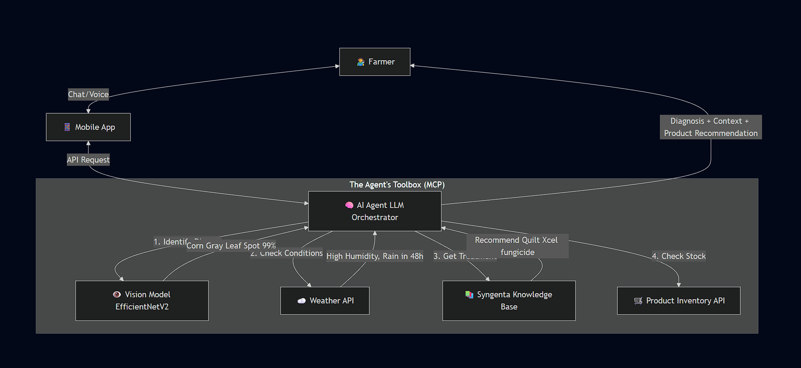

# 🌱 Syngenta Plant Disease Detection System

## 📖 Project Overview

This project implements a Deep Learning solution to assist farmers in detecting plant diseases early using computer vision. Built for the **Syngenta Mobile App AI Module**, this system utilizes **Transfer Learning** with the **EfficientNetV2B0** architecture to classify diseases in Apple, Cherry, Corn, and Blueberry plants with high accuracy (~98%).

The project includes a complete pipeline: **Data Loading, Preprocessing, Model Training (Fine-tuning), Evaluation**, and a user-friendly **Web Interface (Gradio)**.

---

## 🚀 Key Features

- **Lightweight Model:** Uses EfficientNetV2B0, optimized for mobile deployment (approx. 24MB).
- **High Accuracy:** Achieves ~98% validation accuracy.
- **10-Class Detection:** Identifies specific diseases across four different crop types.
- **Interactive App:** Includes a Gradio web interface for real-time inference.
- **Visual Evaluation:** Generates Confusion Matrices and prediction visualizations (Correct vs. Incorrect).

---

## 📂 Dataset Structure

Organize your dataset as follows inside the project root directory:

```

├── data/
│   ├── train/           # Training images (organized by class folders)
│   ├── valid/           # Validation images
│   └── test/            # Test images

````

### Supported Classes

- Apple Scab  
- Apple Black Rot  
- Apple Cedar Rust  
- Apple Healthy  
- Blueberry Healthy  
- Cherry Powdery Mildew  
- Cherry Healthy  
- Corn Gray Leaf Spot  
- Corn Common Rust  
- Corn Northern Leaf Blight  

---

## ⚙️ Installation & Requirements

### 1. Clone the Repository

```bash
git clone https://github.com/AjinkyaBahirat/syngenta_task.git
cd syngenta_task
````

### 2. Install Dependencies

It's recommended to use a Python virtual environment.

```bash
pip install -r requirements.txt
```

**Required Libraries:** TensorFlow, NumPy, Matplotlib, Seaborn, Scikit-learn, Gradio.

---

## 🖥️ How to Run

### **Option 1: Running the Notebook (Training & Analysis)**

1. Open `new_main.ipynb` in Jupyter Notebook, JupyterLab, or Google Colab.
2. **Run All Cells** to execute the training pipeline.
3. Model fine-tuning uses **EfficientNetV2B0**.
4. Generates Confusion Matrix and saves the model as:

   ```
   plant_disease_model_finetuned.keras
   ```
5. Includes scripts to test unseen images in the `test/` folder.

---

### **Option 2: Running the Gradio App (Web Interface)**

You can launch an interactive app to upload leaf images and get predictions.
Run it:

```bash
python app.py
```

---

## 📊 Model Evaluation

* **Accuracy & Loss Curves:** Helps analyze overfitting/underfitting.
* **Confusion Matrix:** Shows which diseases are commonly misclassified
  (e.g., Apple Scab vs. Black Rot).
* **Confidence Thresholding:** Predictions with confidence < 60% can be treated as
  `"Unknown"` or `"Healthy"` to minimize false positives in production.


---
# 💡 Suggested Idea: Syngenta CropGuard AI Agent

## 1. The Core Concept
We propose evolving the current project from a static **"Disease Predictor"** into an active **"AI Agronomist Agent."**

Instead of just labeling a disease (e.g., *"This is Apple Scab"*), this Agent acts as a 24/7 intelligent assistant that "sees" the problem, understands the environmental context (weather, location), and autonomously recommends a comprehensive treatment plan.

**Proposed Name:** *Syngenta CropGuard AI*

---

## 2. Why This Upgrade? (Value Proposition)
Moving from a standard classifier to an Agentic AI system transforms the user experience and value:

| Feature | Current Model (Prediction) | Proposed AI Agent (Action) | Value |
| :--- | :--- | :--- | :--- |
| **User Goal** | "What is this spot?" | "How do I save my crop?" | Solves the *actual* problem, increasing retention. |
| **Outcome** | Passive Information. | **Actionable Advice.** | Can recommend specific Syngenta products (e.g., fungicides) directly. |
| **Data** | Images only. | **Contextual Intelligence.** | Gathers data on *why* spread occurs (Weather + Infection Rate) for R&D. |
| **Interaction**| One-way Input/Output. | **Two-way Conversation.** | Farmers can ask follow-up questions ("Can I spray if it rains tomorrow?"). |

---

## 3. System Architecture (The "Little Architecture")
This system uses an **Orchestrator Pattern**. The LLM (Large Language Model) acts as the "Brain" that intelligently selects the right tools to solve the farmer's problem.



### **Component Breakdown**

1.  **The Brain (LLM):** (e.g., GPT-4o, Claude 3.5) Handles logic and conversation. It decides *which* tool to use based on the user's query.
2.  **Vision Tool:** Our fine-tuned **EfficientNetV2B0** model. The Agent calls this *only* when an image is uploaded.
3.  **MCP (Model Context Protocol):** A standard layer that connects the AI to live data sources:
      * **Weather Data:** To verify if environmental conditions favor disease spread.
      * **Product Database:** To recommend available treatments nearby.

-----

## 4\. Agentic Workflow (User Scenario)

**Scenario:** A farmer uploads a photo of a corn leaf with suspicious spots.

1.  **User:** Uploads photo. *"What's happening to my corn?"*
2.  **Agent (Internal Thought Process):**
      * *Action 1:* I see an image. Call `Vision_Tool`. -\> **Result:** "Corn Gray Leaf Spot".
      * *Action 2:* This fungus thrives in humidity. Call `Weather_MCP`. -\> **Result:** "Humidity 85%, Rain forecast tomorrow."
      * *Action 3:* I need a fast-acting solution before the rain. Call `Product_MCP`. -\> **Result:** "Syngenta Quilt Xcel is in stock nearby."
3.  **Agent (Response to Farmer):**
    > "I've identified **Corn Gray Leaf Spot** on your plant.
    > ⚠️ **Alert:** High humidity in your area is accelerating the spread.
    > **Recommendation:** You need to treat this immediately. Since rain is expected tomorrow, apply **Syngenta Quilt Xcel** within the next 6 hours to ensure it dries in time.
    > [Tap here to order for pickup]"

-----

## 5\. Implementation Plan (Next Steps)

1.  **API Wrapper:** Wrap the current `.keras` model in a fast API (FastAPI/Flask) so the Agent can "call" it.
2.  **LLM Framework:** Use **LangChain** or **LlamaIndex** to build the Orchestrator that manages the tools.
3.  **Integrate MCP:** Connect a Weather API (like OpenWeatherMap) via the Model Context Protocol to give the agent "live" awareness.
4.  **Safety Guardrails:** Implement system prompts to ensure the AI always advises consulting a local expert for critical chemical applications.

## 6\. Strategic Add-on: Proactive Alerts

Because the Agent is connected to real-time data, it can be **proactive**.

  * *Idea:* If the system detects "Gray Leaf Spot" in 50 farms in a specific district, it can send a push notification to *all other users* in that area:
      * *"Warning: Disease outbreak detected 10km from you. Inspect your crops today."*

